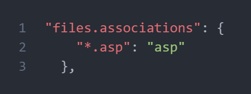
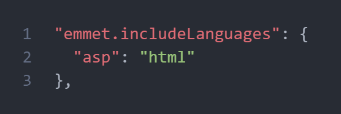

# vdac-casp-snippet
<div align="center">


</div>

###A simple snippet for classic asp written for HUCE IT training program in VN

## Features
`inc | inv` to include a file or virtual
<br />
`os | ios` to start a scripting block
<br />
`ros | iros` to close a scripting block and open another one, useful when you want to return a template in the middle of conditional statement
<br />
```diff
+ rs: output Result object after an SQL query

+ pag: create a code block that handle pagination for your query
+bspag: bootstrap HTML component for pagination navbar (require bootstrap included)

+ qr: create SQL statement
+ genCon: create a connection to your database
+ wres: while loop when result object not EOF
+ ifres : if condition when result object not EOF
+ ifpost : if condition when server receives POST request
```
>Notice: if you have to register .asp file type as an languages in files.associations in your **settings.json**
<div align="center">



</div>

>Notice: if you to have emmet support for your classic ASP project, you'll need to include it to emmet included languages in **settings.json**
<div align="center">



</div>

> Notice: No more shortcut coming anytime soon, but i'm open to suggestions so feel free to comment.
###Version 1.0.0
Initial release of casp-snippet

**Enjoy!**
